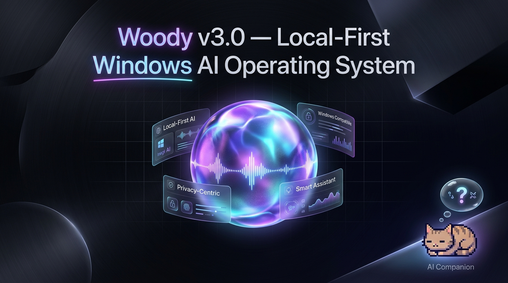
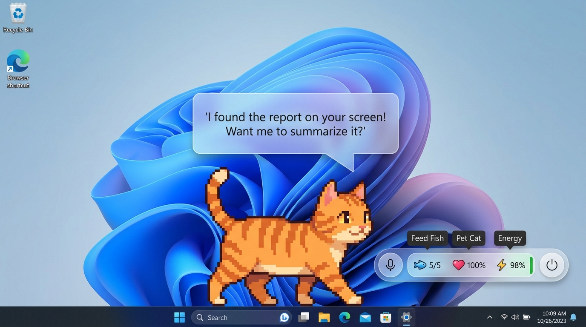
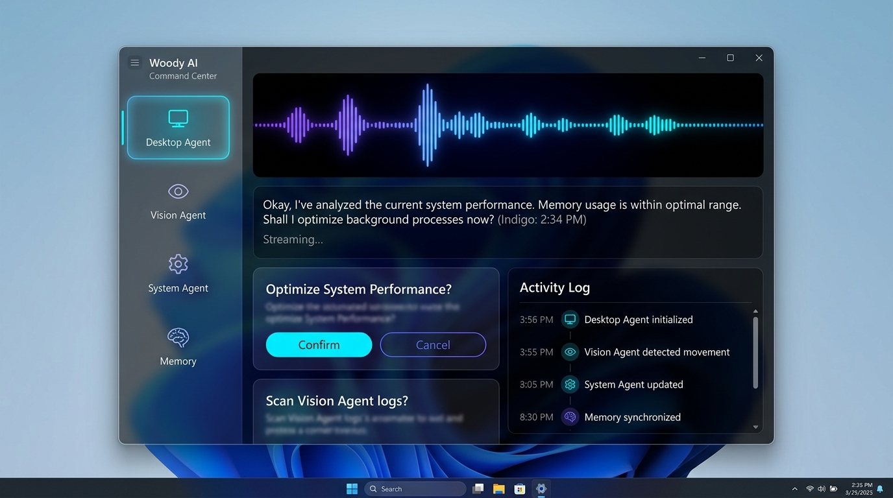

<div align="center">

# 🌟 Woody v3.0 — Local-First Windows AI Operating System Layer

<p align="center">
  
</p>

> **"Perceive. Reason. Act. Learn. Stay invisible until needed."**

Woody is a persistent, multi-agent AI operating layer built natively for Windows — featuring local-first intelligence, multimodal screen perception, real-time voice interaction, fluid glassmorphism command centers, and an interactive animated AI desktop companion.

---

[](https://python.org)
[](https://microsoft.com/windows)
[](https://langchain.com)
[](https://ollama.com)
[](https://inworld.ai)
[](LICENSE)

</div>

---

## ⚡ What's New in the Latest Update

<table>
  <tr>
    <td width="50%" valign="top">
      <h3>🐾 AI Desktop Pet Companion (`--pet`)</h3>
      <ul>
        <li><b>Transparent Always-On-Top Companion:</b> Frameless, floating pixel-art desktop pet with realistic physics, dragging, and dynamic animations.</li>
        <li><b>Autonomous State Machine:</b> Walks across your desktop, naps, stretches, thinks, and plays based on interactions.</li>
        <li><b>Mood & Stats System:</b> Tracks Energy ⚡, Happiness 💖, and Fish Snacks 🐟 in real time.</li>
        <li><b>Neural Inworld Voice (TTS-2):</b> Expressive, personality-driven speech synthesis with native sound cues (meows, purrs, chimes).</li>
      </ul>
    </td>
    <td width="50%" valign="top">
      <h3>🔮 Liquid Glass Command Center (`--web-ui`)</h3>
      <ul>
        <li><b>Apple Intelligence-Inspired UI:</b> Refractive glassmorphism with dynamic ambient lighting, specular depth, and fluid spring animations.</li>
        <li><b>Live Audio Visualizer:</b> Real-time dynamic voice gradient glowing orb & responsive spectrum waveforms.</li>
        <li><b>Streaming Swarm Transcripts:</b> Instant markdown chat stream, step-by-step reasoning nodes, and activity audit log.</li>
        <li><b>Interactive Confirmation Cards:</b> Inline approvals for high-privilege system actions before execution.</li>
      </ul>
    </td>
  </tr>
  <tr>
    <td width="50%" valign="top">
      <h3>👁️ Multimodal Screen Vision Agent</h3>
      <ul>
        <li><b>Live Screen Analysis:</b> Seamlessly inspects active windows, multi-monitor setups, and UI controls via Groq Llama-3.2 Vision / Qwen2.5-VL.</li>
        <li><b>Low-Overhead Event Hooks:</b> Event-driven Win32 hooks trigger screen perception without draining CPU/battery.</li>
        <li><b>Visual UI Grounding:</b> Recognizes buttons, input fields, forms, and error dialogs for high-precision desktop automation.</li>
      </ul>
    </td>
    <td width="50%" valign="top">
      <h3>🚀 Pipelined Speech & Multi-Agent Swarm</h3>
      <ul>
        <li><b>Sub-Second Voice Loop:</b> OpenWakeWord ("Hey Woody") + Silero VAD + Faster-Whisper streaming STT.</li>
        <li><b>LangGraph Swarm Routing:</b> Autonomous intent decomposition between Desktop, Vision, System, and Chat agents.</li>
        <li><b>Critic/Verifier Self-Correction:</b> Automated verification loops ensure desktop commands succeed accurately.</li>
      </ul>
    </td>
  </tr>
</table>

---

## 🐾 Meet Woody — Your AI Desktop Pet Companion

Woody is not just a background daemon; it comes with an animated, interactive **AI Desktop Pet** that lives directly on your Windows desktop. Ask questions, have it inspect your screen, or just feed it fish and let it explore your workspace!

<p align="center">
  
</p>

### 🎬 Animated Pet Sprite States

<div align="center">

| Walking Right | Idle & Observing | Going to Sleep | Sleeping | Waking Up |
|:---:|:---:|:---:|:---:|:---:|
|  |  |  |  |  |
| `walk_positive` | `idle` | `idle_to_sleep` | `sleep` | `sleep_to_idle` |

</div>

- **Liquid Glass Thought & Speech Bubbles:** Displays real-time streaming AI answers with text-to-speech synchronization.
- **Interactive Action Bar:** Feed fish snacks (`🐟 5/5`), pet the companion to increase mood (`💖 100%`), check battery/energy (`⚡ 98%`), or trigger voice listening.
- **Physics & Screen Awareness:** Runs, naps, and stays responsive while floating over your active IDEs, browsers, and games.

```bash
# Launch Woody in Desktop Pet mode
woody --pet
```

---

## 🔮 Liquid Glass Command Center & Web Overlay

Woody features a state-of-the-art UI system crafted with **Apple-inspired fluid glassmorphism**, specular catch-lights, and responsive ambient backdrops.

<p align="center">
  
</p>

- **Dynamic Voice Visualizer Orb:** Glows and modulates in real-time as you speak or when Woody responds.
- **Live Markdown Stream:** Watch agent reasoning steps, code blocks, and formatted summaries appear incrementally.
- **Multi-Agent Switcher:** Monitor real-time statuses for **Desktop Agent**, **Vision Agent**, **System Agent**, and **Memory**.
- **Human-in-the-Loop Safety:** Destructive actions (e.g. deleting files, closing unsaved apps) generate inline confirmation cards requiring explicit authorization.

```bash
# Launch Woody with the full Glassmorphism WebEngine Overlay
woody --web-ui

# Launch with native PySide6 floating bar
woody
```

---

## 🏗️ Multi-Agent Swarm Architecture

```
                  ┌─────────────────────────────────────────┐
                  │   User Input (Voice / Hotkey / Web UI)  │
                  └────────────────────┬────────────────────┘
                                       │
                  ┌────────────────────▼────────────────────┐
                  │             Perception Bus              │
                  │   Wake Word → Silero VAD → Whisper STT  │
                  │   Event-Driven Win32 Screen & OCR Hook  │
                  └────────────────────┬────────────────────┘
                                       │
                  ┌────────────────────▼────────────────────┐
                  │    LangGraph Router & Task Planner      │
                  │ (Fast Intent Classification & Decompose)│
                  └────────────────────┬────────────────────┘
                                       │
         ┌─────────────────────────────┼─────────────────────────────┐
         ▼                             ▼                             ▼
  ┌───────────────┐             ┌───────────────┐             ┌───────────────┐
  │ Desktop Agent │             │ Vision Agent  │             │ System Agent  │
  │ Win32/pywinauto             │ Llama 3.2-VL  │             │ psutil / WMI  │
  │ Click, Type,  │             │ Visual Reason │             │ Telemetry &   │
  │ Window Ops    │             │ UI Grounding  │             │ Process Mgt   │
  └───────┬───────┘             └───────┬───────┘             └───────┬───────┘
          │                             │                             │
          └─────────────────────────────┼─────────────────────────────┘
                                       │
                  ┌────────────────────▼────────────────────┐
                  │         Critic / Verifier Loop          │
                  │ (Outcome Check & Self-Correction Engine)│
                  └────────────────────┬────────────────────┘
                                       │
                  ┌────────────────────▼────────────────────┐
                  │       Synthesizer & Audio Pipeline      │
                  │ (Inworld AI TTS-2 / Piper / Kokoro / Edge)│
                  └────────────────────┬────────────────────┘
                                       │
              ┌────────────────────────┴────────────────────────┐
              ▼                                                 ▼
     ┌───────────────────┐                             ┌───────────────────┐
     │  Desktop AI Pet   │                             │  Command Center   │
     │  (Bubble + Audio) │                             │ (Glassmorphic UI) │
     └───────────────────┘                             └───────────────────┘
```

---

## 🕹️ Launch Modes & CLI Reference

| Command | Description | Best For |
|---|---|---|
| `woody` | Full application with native PySide6 floating glass bar & tray | Daily desktop workflow |
| `woody --pet` | Interactive animated AI desktop cat companion | Cozy desk buddy & casual voice control |
| `woody --web-ui` | Apple-inspired fluid glassmorphic Command Center | Rich visual multi-agent experience |
| `woody --serve` | Headless FastAPI backend daemon (REST API + SSE) | Headless servers, background services |
| `woody --kernel-only` | Pure REPL terminal interface (no GUI) | Debugging, CLI scripting |
| `woody --eval` | Automated Phase evaluation & benchmark suite | Verification & quality testing |

---

## 🚀 Quick Start

### 1. Prerequisites
- **Windows 10 / 11** (Required for Win32 API & UI Automation)
- **Python 3.12+** — [Download from python.org](https://python.org/downloads/)
- **Ollama** (for local offline LLMs) — [ollama.com](https://ollama.com)
- *(Optional)* **Groq API Key** / **Inworld AI Key** (for cloud acceleration & neural pet voice)

### 2. Installation

```powershell
# Clone the repository
git clone https://github.com/Pushkarmehra/Wodi.git
cd Wodi

# Run automated Windows setup script
.\scripts\install.ps1

# Or install manually with optional extras:
pip install -e ".[dev,audio,desktop,vision,ui,llm]"
```

### 3. Configure API Keys (Optional for Cloud Boost)

Copy `.env.example` to `.env` and fill in your keys:

```ini
# Neural Voice & LLM Keys
INWORLD_API_KEY="your_inworld_key"
GROQ_API_KEY="your_groq_key"
GEMINI_API_KEY="your_gemini_key"
```

### 4. Pull Local Ollama Models

```bash
# Recommended models
ollama pull qwen2.5:7b
ollama pull nomic-embed-text
```

### 5. Launch Woody!

```bash
# Start your AI Desktop Companion
python -m woody --pet

# Or open the modern Command Center
python -m woody --web-ui
```

---

## 🎤 Natural Language Usage Examples

| Domain | Voice / Text Prompt | Agent Executing |
|---|---|---|
| **Desktop Automation** | *"Open Notepad, type my grocery list, and save it to Desktop"* | Desktop Agent (Win32) |
| **Multimodal Vision** | *"Look at my screen and summarize this open document"* | Vision Agent (Llama 3.2-VL) |
| **System Diagnostics** | *"What processes are taking up the most RAM right now?"* | System Agent (psutil) |
| **Browser Workflow** | *"Open Chrome, search for latest AI papers, and open GitHub"* | Browser / Desktop Agent |
| **Pet Interaction** | *"Hey Woody, come here!"* / Click to feed fish 🐟 / Pet head 💖 | Desktop Pet State Machine |
| **Contextual Memory** | *"Where did I leave off on my machine learning project?"* | Episodic Memory & RAG |

---

## ⚙️ Configuration & Hardware Tiers

Woody automatically detects your system hardware on boot and configures the optimal tier. You can customize settings in [`config/woody_config.yaml`](config/woody_config.yaml):

```yaml
general:
  name: "Woody"
  tier: "auto"                 # auto | lite | standard | pro

perception:
  wake_word:
    enabled: true
    engine: "openwakeword"     # openwakeword | porcupine | disabled
    phrase: "hey woody"
  vad:
    enabled: true
    threshold: 0.55
  stt:
    model: "base"              # tiny | base | small | medium | large-v3

models:
  provider: "groq"             # groq | ollama | openai
  router: "openai/gpt-oss-20b"
  planner: "openai/gpt-oss-120b"
  vision: "llama-3.2-11b-vision-preview"

agents:
  desktop:
    enabled: true
  vision:
    enabled: true
```

| Tier | Minimum Specs | Models Used | STT Engine |
|---|---|---|---|
| **Lite** | Intel Core i5 / 8GB RAM (CPU only) | `qwen2.5:1.5b` / Groq Cloud | Whisper `tiny` / `base` |
| **Standard** | RTX 3060 / 16GB RAM / NPU | `qwen2.5:7b` + `nomic-embed` | Whisper `small` + Silero |
| **Pro** | RTX 4080+ / 32GB+ RAM | `qwen2.5:14b` + Qwen2.5-VL | Whisper `medium` / `large-v3` |

---

## 🔒 Security, Safety & Privacy

- **Local-First Privacy:** All sensitive data, screenshots, and audio can run completely locally on your hardware.
- **Permission Tiers:** High-impact actions (file deletion, registry edits, system shutdown) require inline interactive user confirmation.
- **Prompt Injection Defense:** Screen OCR and clipboard inputs are treated as **untrusted data**, never direct instruction prompts.
- **Audit Logging:** Every planner step, tool execution, and agent response is logged to a local SQLite database for full transparency.

---

## 🗺️ Roadmap & Phase Milestones

| Phase | Description | Status |
|---|---|---|
| **Phase 0** | Wake word ("Hey Woody"), Silero VAD, Streaming STT, Audio Pipeline | ✅ Completed |
| **Phase 1** | LangGraph Planner, Desktop Agent, Win32 Automation, Critic Loop | ✅ Completed |
| **Phase 2** | Multimodal Vision Agent, Event-Driven Screen Hooks, OCR Grounding | ✅ Completed |
| **Phase 3** | Animated AI Desktop Pet Companion (`--pet`), Inworld Neural TTS-2 | ✅ Completed |
| **Phase 4** | Apple-Inspired Fluid Glassmorphism Command Center (`--web-ui`) | ✅ Completed |
| **Phase 5** | Browser Agent (Playwright), Autonomous Coding Sandbox, Local RAG | 🔄 In Progress |
| **Phase 6** | One-Click Signed Windows MSIX Installer & Auto-Updater | 🔲 Planned |

---

## 📄 License & Attribution

- Released under the **[MIT License](LICENSE)**.
- Built with ❤️ for Windows automation enthusiasts and AI agent builders.
- Special thanks to the open-source communities behind **LangGraph**, **Ollama**, **PySide6**, **Silero VAD**, and **Faster-Whisper**.
